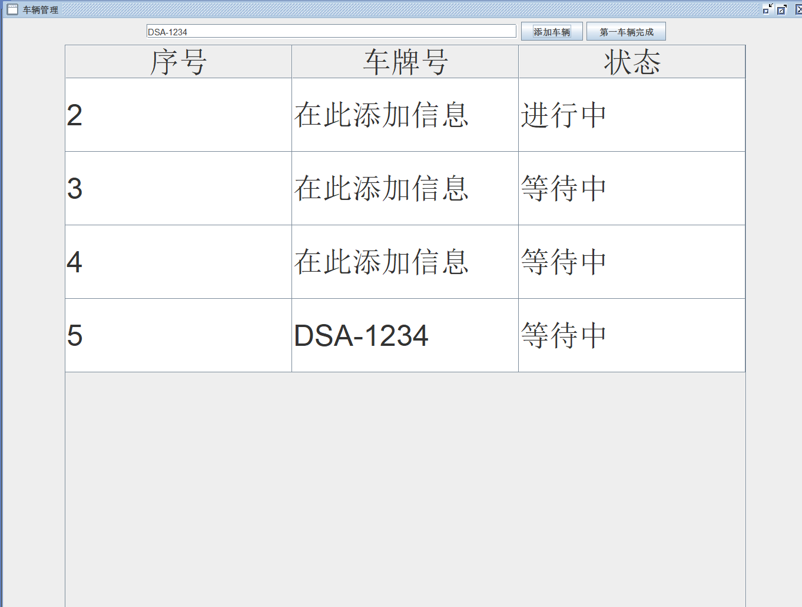
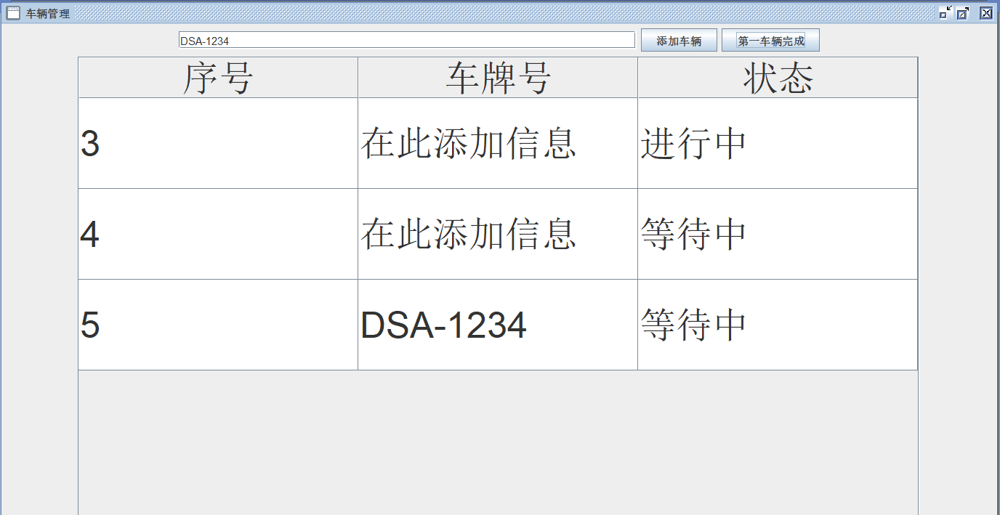

# State Management System

## Overview
This project implements a **state management system** in Java. It handles different states of a process or task and includes a graphical user interface (GUI) for interaction. Below is a detailed description of the main components and their functionality.

---

## Table of Contents
- [Key Classes](#key-classes)
  - [State Class](#state-class)
- [Features](#features)
- [How to Use](#how-to-use)
- [Installation](#installation)
- [Contribution Guidelines](#contribution-guidelines)
- [License](#license)

---

## Key Classes

### State Class

- **Purpose:**  
  This class represents the state of a process.

- **Attributes:**  
  - `state` (int): Can hold the following values:
    - **-1**: "等待中" (*Waiting*)
    - **0**: "进行中" (*In Progress*)
    - **1**: "已完成" (*Completed*)

- **Methods:**
  - `getState()`: Returns the current state as an integer.
  - `toString()`: Provides a string description of the current state in **Chinese**.
  - `changeState()`: Advances the state sequentially from **-1** to **0** to **1**, where **1** is the terminal state.

---

## Features

- **State Transitions:**  
  Seamless transitions between the states: **Waiting**, **In Progress**, and **Completed**.
  
- **Error Handling:**  
  If an invalid state is detected, it returns `"错误"` (*Error*).
  
- **Change Logic:**  
  Prevents state transitions beyond the terminal state (`1`), ensuring logical state progression.

---

## How to Use

1. **Compile the Project**  
   Use any Java development environment to compile the files.

2. **Run the Application**  
   Interact with the process states using the provided GUI.

3. **State Management**  
   The `State` class manages state transitions, progressing from **Waiting** to **Completed**.

---

## Installation

1. Clone the repository:
   ```bash
   git clone <repository-url>

## Domo

1. **Adding Vehicle**  
   Press the top button on the right of the search bar.
   
   

2. **Completed Vehicle**  
   Press the button next to the last one.
   
   
